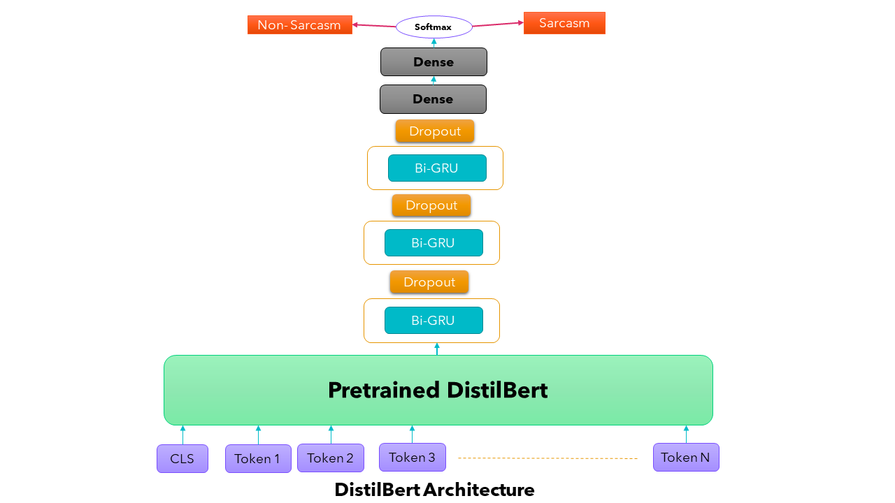
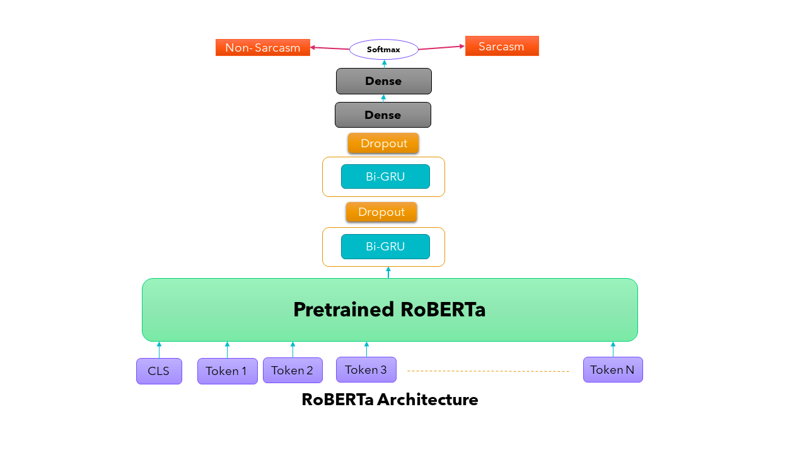
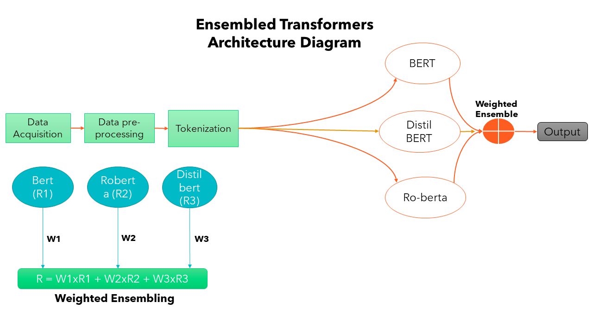

# Hybrid Ensemble Transformer Learning for Multi-Label Text Classification

This repository contains the code for "Hybrid Ensemble Transformer Learning for Single and Multi-Label Text Classification" 
This approach shows how you can combine 3 different transformers through weighted ensembling approach. 

It also shows the method for finetuning the transformers with additional layers.

In order to learn more about the code, feel free to reach out on my [linkedin profile] (https://www.linkedin.com/in/furqan4545/)

